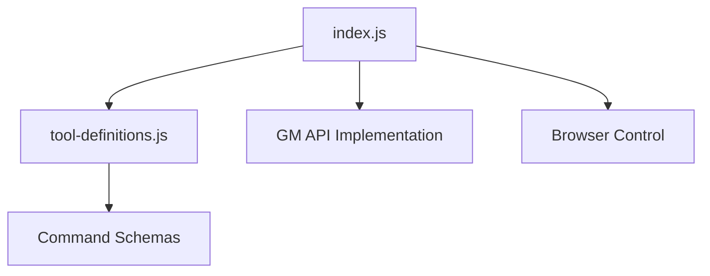

# Essential Files for LLM Integration

## Core Implementation Files

### `/build/index.js`
Main implementation file containing:
- MCP server setup
- Browser automation logic
- GM API implementation
- Request interception handling
- Tool handlers

### `/build/tool-definitions.js`
Tool definitions including:
- Command schemas
- Input validation
- Command descriptions
- Default values

## Documentation Files

### `/COMMANDS.md`
Complete command reference with:
- Command syntax
- Usage examples
- Use case descriptions

### `/README.md`
Project documentation containing:
- Feature overview
- Installation instructions
- Quick start guide
- Implementation details

## Configuration Files

### `/package.json`
Project configuration including:
- Dependencies
- Scripts
- Project metadata
- Build settings

### `/.gitignore`
Git ignore patterns for:
- Log files
- Temporary files
- Build artifacts
- Development files

## Installation Instructions

1. Clone repository
2. Run `npm install`
3. Update the following files as needed:
   - `package.json`: Project configuration
   - `tool-definitions.js`: Command definitions
   - `index.js`: Implementation logic

## Key Implementation Notes

### Browser Automation
Main browser control is in `/build/index.js`:
```javascript
async launch_browser(args) {
    // Browser launch implementation
}
```

### GM API Support
GM API functions in `/build/index.js`:
```javascript
const GM_API = `
    window.GM_addStyle = function(css) { ... }
    window.GM_setValue = function(key, value) { ... }
    // etc.
`;
```

### Command Definitions
Tool definitions in `/build/tool-definitions.js`:
```javascript
{
    name: 'tool_name',
    description: 'Tool description',
    inputSchema: {
        // Input validation schema
    }
}
```

## Development Guidelines

1. All changes should maintain MCP protocol compatibility
2. Debug output goes to log files, not console
3. Follow existing code patterns for consistency
4. Update documentation for any new features

## Essential File Dependencies



## Testing New Features

1. Update `tool-definitions.js` with new command
2. Implement handler in `index.js`
3. Add documentation to `COMMANDS.md`
4. Test with example commands